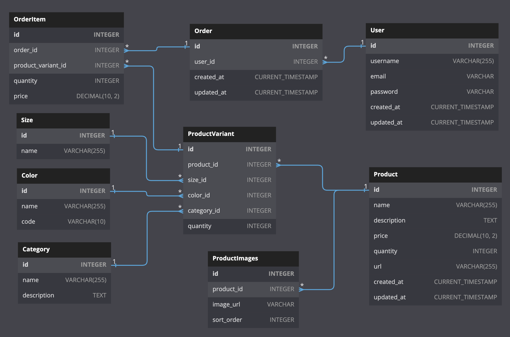

# FINESSE Take-Home Challenge

## Overall
First, thank you for providing me with the opportunity to work on this take-home coding assessment for FINESSE. It has been a challenging and rewarding experience to showcase my front-end and back-end skills while keeping in mind the needs of Gen Z users. I appreciate the chance to contribute to the development of a customer-facing platform that aims to be accessible, beautiful, and engaging for diverse audiences.

I chose to use Next.js as the framework for building the FINESSE website due to its numerous benefits. Next.js is a powerful and popular framework for React applications that offers server-side rendering (SSR) and static site generation (SSG) out of the box. These features provide significant advantages in terms of performance, SEO, and scalability. With Next.js, I was able to create a fast and optimized website that loads quickly, improves search engine visibility, and provides a smooth user experience. Furthermore, Next.js offers a rich ecosystem of tools and libraries, seamless integration with React components, and simplified routing and navigation through its built-in router. The robustness, efficiency, and developer-friendly nature of Next.js made it a natural choice for building a modern, high-quality web application like FINESSE.

## Issue resolved in code
The problem I encountered in the mobile version of the FINESSE website was related to the zoom functionality on the product page. When zooming in, the image would become too zoomed in, leading to incorrect framing and confusion for the user. To address this issue, I chose to implement a solution using Swiper and React hooks. The main file can be found at `pages/products/[product].tsx` along with the styling and relevant components in the `styles` and `components` folders respectively.

To solve the zoom issue, I utilized the Swiper library, which provides a responsive and customizable image gallery component. Swiper allowed me to control the zoom behavior and ensure that the images were framed correctly when zoomed in on mobile devices. By integrating Swiper into the product page, I was able to enhance the user experience and provide a more intuitive zooming functionality.

For the implementation, I used React hooks, specifically the `useState` hook, to manage the state of the full-screen mode. The `isFullScreen` state variable allowed me to toggle between full-screen and regular viewing modes. When the user clicks on an image, the `handleToggleFullScreen` function is triggered, which opens or closes the full-screen mode based on the current state. I utilized the `requestFullscreen` and `exitFullscreen` methods to enter and exit full-screen mode, respectively.

By combining Swiper, React hooks, and the Next.js framework, I was able to solve the zoom issue and improve the mobile user experience on the FINESSE website. Swiper provided a reliable and feature-rich image gallery component, while React hooks facilitated efficient state management. The Next.js framework enabled server-side rendering, enhancing performance and SEO.

In summary, I addressed the problem of incorrect zoom framing on the mobile version of the FINESSE website by implementing a solution using Swiper and React hooks. The chosen technologies provided the necessary tools and functionalities to solve the issue effectively. By incorporating Swiper and React hooks into the product page, I achieved a more seamless and user-friendly zooming experience for mobile users.

## Issues 
Here are three issues I found with performance with the current website.
1. Currently rerenders the entire page instead of only required elements:

- Rerendering an entire page is slower than selectively rerendering necessary components. Next.js utilizes React's virtual DOM and reconciliation algorithm to identify and update only changed components, minimizing rendering work. It offers server-side rendering and static site generation for faster initial load times and pre-rendered pages. Additionally, Next.js introduces incremental static regeneration for background updates and optimized client-side navigation, resulting in improved performance and user experience. Leveraging these Next.js features optimizes rendering efficiency, reduces unnecessary work, and provides efficient server-side rendering and static generation capabilities.

2. Filter by Drop feature is incredibly frustrating:

- The current Filter by Drop feature on the FINESSE platform needs improvement for better user experience. The overwhelming carousel and lack of deselecting options make navigation challenging. To enhance exploration, I suggest adding a search bar and drop-down feature. By incorporating deselect or toggle functionality, users can refine their search criteria easily. These improvements will empower users to explore FINESSE's collection, benefiting those interested in vintage fashion. I'm excited about developing this enhanced functionality as it aligns with my passion for fashion and user-centered design.

3. The sidebar feature is very small and a bit uncomfortable to use:

- The current sidebar on the FINESSE platform is small and challenging to navigate. To enhance the user experience, I recommend introducing a more prominent and user-friendly navigation system. Splitting the features into a navigation bar would improve organization and ease of use. Additionally, an "About" section could showcase what sets FINESSE apart, including its AI-driven model for personalized recommendations, size inclusivity, and commitment to sustainability. Revamping the sidebar into a well-designed navigation bar with an informative "About" section would deliver a more intuitive browsing experience, showcasing FINESSE's unique brand story.

## Additional Written Questions

### If you could improve one thing about FINESSE right now - as you experience it - what would it be and why?
If I could improve one thing about FINESSE right now, I would focus on refining the user flow and overall experience while maintaining the platform's beautiful UI. While the visual design is aesthetically pleasing, there is an opportunity to enhance the seamless and intuitive navigation throughout the website. Currently, the user flow feels a bit clunky, making it less effortless to explore the content and engage with the platform. By streamlining the browsing experience, optimizing interactions, and ensuring a cohesive flow between different sections, FINESSE can create a more immersive and enjoyable journey for its Gen Z audience. This would involve carefully examining the user journey, identifying pain points, and implementing thoughtful improvements to create a fluid and captivating experience from the moment users land on the site. By focusing on the flow and ensuring a seamless transition between different sections, FINESSE can amplify the appeal of its beautiful UI, ultimately captivating and retaining its audience's attention while embodying the brand's commitment to accessible and curated fashion content.

### Your plane crashes and you land on an island. What do you do? How do you plan your survival?
In the face of a plane crash that leaves me stranded on an island, my approach to survival would be characterized by a compassionate and nurturing leadership style. Recognizing the immense stress and trauma that such an event brings, my primary focus would be to create a sense of safety, unity, and care within the community.

Upon assessing the situation, my first priority would be to foster a calm and supportive environment. By promoting open communication and active listening, I would encourage individuals to express their concerns, fears, and needs. Creating a space where everyone feels heard and understood would be instrumental in building trust and cohesion among the survivors.

Together with the group, we would collaboratively plan for our survival, taking into consideration immediate needs such as food, water, shelter, and basic medical care. Relying on the diverse skills and strengths within our community, I would encourage participation and ensure that tasks are assigned in a fair and inclusive manner. By valuing each person's unique abilities, we would create a sense of empowerment and collective responsibility.

Maintaining a positive outlook and fostering hope would be paramount. I would emphasize the importance of celebrating even the smallest victories and milestones, as they serve as reminders of our resilience. Encouraging moments of self-care, reflection, and emotional support would be essential for everyone's well-being during this challenging time.

Throughout our journey, my goal would be to cultivate a nurturing and inclusive environment, where each person's voice is heard and valued. By leading with compassion, I would strive to uplift spirits, inspire resilience, and foster a sense of unity. Together, we would navigate the difficulties, support one another, and maintain hope for a brighter future.

### What matters to you most and why?
What matters to me most is personal growth and its practical application in my everyday life. I find immense value in continually learning, exploring new ideas, and developing new skills. This pursuit of growth allows me to expand my knowledge, broaden my perspectives, and discover new opportunities. It's through this continuous process of self-improvement and applying what I've learned that I find a deep sense of satisfaction and fulfillment. I believe that success is not just about reaching specific milestones, but rather about the ongoing journey of growth and progress. It's the constant pursuit of self-improvement and the application of that growth that truly matters to me and defines my personal sense of success.

## Further Developement
For this assessment, I mainly focused on the frontend. I wanted focus on the deliverables, but also was conscious of the full stack 

In building out the backend functionality for the take-home application, I would adopt a balanced approach between Next.js API calls and server API calls to ensure an optimal user experience. Next.js API routes would be used for handling simpler and more lightweight requests, such as fetching static data or performing client-side operations. On the other hand, for more complex backend/database queries and operations, I would rely on Node.js and Express.js.

To achieve this, I would utilize Next.js API routes for handling frontend requests that do not require extensive processing or interaction with the database. These routes would be ideal for fetching static data, such as product information, or performing simple calculations and transformations on the client side. By using Next.js API routes, I can take advantage of the framework's built-in serverless architecture, which provides a convenient and efficient way to handle these types of requests.

For more advanced backend functionality, such as querying the database for dynamic data or performing complex data manipulations, I would utilize Node.js and Express.js. This would involve creating dedicated server routes and endpoints in Express.js to handle these requests. By leveraging the flexibility and power of Node.js, I can implement custom business logic, interact with the database using appropriate ORM libraries, and perform any necessary data processing or transformations.

In addition to the API calls, I would also incorporate the use of localStorage to save necessary information for the ecommerce website. I would use localStorage to store relevant user data, such as the user's cart items, selected preferences, or session information. This would enable a seamless and persistent user experience, allowing users to revisit the website and have their previous selections and preferences preserved.

By striking a balance between Next.js API calls and server API calls, and leveraging localStorage for client-side data storage, I can optimize the application's performance, minimize unnecessary backend requests, and enhance the overall user experience. This approach would allow for efficient handling of different types of requests, ensuring that simpler operations are handled by Next.js API routes while more complex backend/database queries are managed by Node.js and Express.js.

Here's a general idea of what the SQL database would look like.
